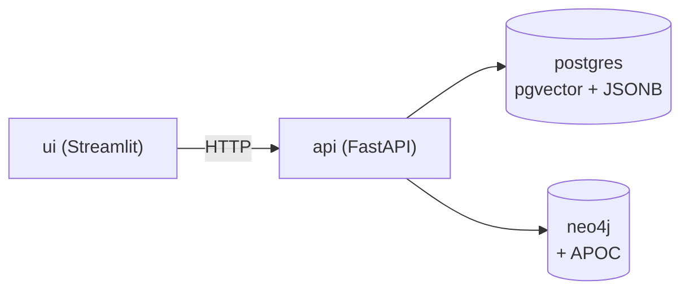
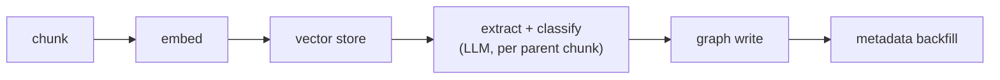
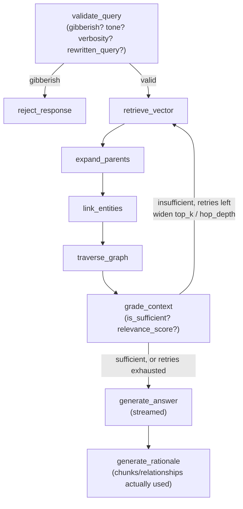

# GraphRAG

A hierarchical-chunking, graph-augmented RAG system: FastAPI + LangGraph for
the backend pipeline, Postgres/pgvector for chunk storage and vector search,
Neo4j for the knowledge graph, and a Streamlit frontend for chat + graph
exploration.

Documents are chunked into large "parent" blocks and small "child" blocks
(small-to-big retrieval), embedded, and passed through an LLM extraction
step that also builds a per-document knowledge graph. Chat queries run
through an agentic LangGraph pipeline that validates the query, retrieves
and grades context (retrying with widened parameters if insufficient), and
generates a grounded, streamed answer with a rationale explaining what was
actually used.

## Architecture

Four services, all started by `docker compose up`:



- **postgres** (`pgvector/pgvector:pg16`) -- `documents`, `parent_chunks`,
  `child_chunks` (vector column, HNSW index), `query_logs` (audit trail of
  completed chat turns).
- **neo4j** (`neo4j:5-community` + APOC) -- the knowledge graph: entities as
  nodes, extracted relationships as edges, N-hop traversal at query time.
- **api** (FastAPI) -- ingestion and chat pipelines, described below.
- **ui** (Streamlit) -- chat with citations/graph view, plus a standalone
  graph explorer tab.

### Ingest pipeline



Text is split into parent chunks (~1000 tokens) and child chunks (~200
tokens, small-to-big retrieval). Children are embedded and upserted into
pgvector. Each parent chunk then goes through one LLM call that extracts
typed entities/relationships *and* classifies the parent's `section_title`
and `content_type` (`prose`/`table`/`list`/`other`) in the same response.
The graph write happens first; the classification is backfilled onto the
already-saved parent/child rows afterward (`UPDATE`, not part of the
original insert) so an extraction failure never loses the chunks or
vectors that were already durably saved -- only graph enrichment for that
parent is lost.

### Chat pipeline (LangGraph, real conditional/cyclic edges)



`validate_query` short-circuits gibberish input before any retrieval runs,
and rewrites the query using conversation history (e.g. "what about their
2023 revenue?" -> "What was Acme Corp's 2023 revenue?"). `grade_context`
grades the assembled parent text + graph triples for sufficiency; if
insufficient, it widens `top_k` (x1.5) and `hop_depth` (+1) and loops back
to `retrieve_vector`, bounded by `max_context_retries` (default 1).
`generate_answer` streams token-by-token over SSE; `generate_rationale`
runs afterward (it needs the finished answer text) and explains which
citations/relationships were actually drawn on. Every completed turn is
recorded in `query_logs` (rejected/gibberish turns are not).

## Setup

```bash
cp .env.example .env
# edit .env -- see below for the two supported ways to fill it in
docker compose up --build
```

- **api** on `http://localhost:8000` (`/api/v1/health`, `/api/v1/ingest`,
  `/api/v1/chat`, `/api/v1/graph/subgraph`)
- **ui** on `http://localhost:8501`
- **neo4j browser** on `http://localhost:7474`

### `.env` -- OpenAI or an OpenAI-compatible endpoint

`OPENAI_BASE_URL` is optional. Leave it unset to use `api.openai.com`
directly with a real OpenAI key. Or point it at any OpenAI-compatible
endpoint -- this repo has verified it for real against
[OpenRouter](https://openrouter.ai)'s free-tier models:

```
OPENAI_BASE_URL=https://openrouter.ai/api/v1
OPENAI_API_KEY=<your OpenRouter key>
LLM_MODEL=minimax/minimax-m2.7:free
EMBEDDING_MODEL=openai/text-embedding-3-small
```

(the `openai/` prefix on the embedding model is required by OpenRouter's
embeddings endpoint; `text-embedding-3-small` returns 1536 dimensions
either way, matching the schema with no migration needed.)

**Bug worth knowing about if you add new env vars**: `docker-compose.yml`'s
`api` service only forwards environment variables it explicitly lists in
its `environment:` block. Adding a variable to `.env` alone does nothing
until it's also added there -- this bit the `OPENAI_BASE_URL` rollout (see
`PROGRESS.md`) and would bite any new var the same way. Verify with
`docker exec graphrag-api-1 env | grep <VAR>` after adding one.

## Sample queries

These are the actual results from a real run against the OpenRouter
configuration above (`minimax/minimax-m2.7:free` for chat,
`openai/text-embedding-3-small` for embeddings) -- see `VERIFICATION.md`
for the full report. Not paraphrased or hypothetical.

**Ingest** (`POST /api/v1/ingest`, a 3-section, ~180-word document about an
acquisition):

```json
{"document_id":"real-test-1","status":"succeeded","parent_chunk_count":1,"child_chunk_count":2,"node_count":8,"relationship_count":9}
```

All 8 extracted entities were correctly identified and typed (`Acme Corp`
/ `Startup Inc` as Organization, `Jane Smith` / `John Doe` as Person,
`San Francisco` / `New York` / `London` as Location, `Natural Language
Processing` as Technology), and all 9 relationships checked against exact
supporting text, e.g. `(Acme Corp)-[ACQUIRED]->(Startup Inc)` with evidence
*"Acme Corp acquired Startup Inc in March 2024 for $50 million"* -- an
exact substring match against the source document. No hallucinated
entities or relationships.

**Chat -- grounded question** (`POST /api/v1/chat`):

> Query: "Who acquired Startup Inc and how much did it cost?"
>
> Answer: **"Acme Corp acquired Startup Inc for $50 million."**
>
> Rationale: *"The answer states that Acme Corp acquired Startup Inc for
> $50 million. This matches the text in the retrieved citations (both
> parent_ids) that say 'Acme Corp acquired Startup Inc in March 2024 for
> $50 million'. The knowledge-graph relationship
> (Acme Corp)-[ACQUIRED]->(Startup Inc) captures the acquisition event and
> was used to confirm the fact."*
>
> `chunks_used`: `["real-test-1:p0:5351431d", "real-test-1:p0:c6fb1b65"]`,
> `relationships_used`: `["Acme Corp -> ACQUIRED -> Startup Inc"]`
>
> Latency: **35.4s** end-to-end (4 sequential LLM calls -- `validate_query`,
> `grade_context`, `generate_answer`, `generate_rationale` -- on a
> free-tier model with no dedicated capacity).

**Chat -- gibberish rejection** (`POST /api/v1/chat`, query `"asdkjf
qwoeiru zzz blorp"`):

```
data: {"type":"citations","data":[]}
data: {"type":"triples","data":[]}
data: {"type":"token","data":"It looks like that message might have been a typo or got jumbled. Could you try rephrasing your question?"}
data: {"type":"done","data":null}
```

`citations`/`triples` are empty, confirming `validate_query` short-circuited
*before* any retrieval ran -- not just that the final answer happened to
read as a rejection. No `rationale` event, and no `query_logs` row (the
reject path skips both).

## Trade-offs

Design decisions made under take-home time constraints, each with a real
alternative that was considered and set aside:

- **pgvector vs. a dedicated vector DB** (Qdrant, originally used, migrated
  away from). One Postgres instance backs child-chunk vectors, parent
  chunks, and the query-log audit table instead of running a separate
  vector database alongside Postgres. Simpler ops, one fewer moving part,
  and JSONB metadata + vector search compose naturally in the same SQL
  query (see the `section_title`/`content_type` filters below). Trade-off:
  a dedicated vector DB (Qdrant, Pinecone, etc.) would out-scale pgvector's
  HNSW index at much larger corpora -- not a concern at this project's
  scale.
- **Bounded widen-and-retry vs. a full ReAct tool-calling loop.**
  `grade_context` retries retrieval with a wider `top_k`/`hop_depth` (up to
  `max_context_retries`, default 1) rather than exposing `vector_search`
  and `graph_traverse` as tools an LLM decides whether to call again. More
  predictable cost and latency (bounded number of extra LLM calls, known
  up front) at the cost of being less adaptive than a real agentic loop
  that could decide *which* retrieval action to take next.
- **Per-parent vs. per-child classification granularity.**
  `section_title`/`content_type` are classified once per parent chunk
  (~1000 tokens) and inherited by all of its children, rather than
  classifying every child individually. Children outnumber parents roughly
  5:1 at the chunker's default sizing, so per-child classification would
  be ~5x the LLM calls at ingestion time for marginal precision gain.
- **Cheap substring-match entity linking vs. real NER.** Query-time entity
  linking (`find_node_ids_by_name_fragment`) is a literal substring match
  of retrieved parent text against all graph node names, not a real
  NER/entity-linking model. Fast and dependency-free, but will both miss
  paraphrased references and occasionally over-match short/common names.
- **Similarity-based candidate matching (APOC Dice similarity), not
  embeddings.** Graph node ids are no longer document-scoped
  (`app/graph/extraction.py` generates a provisional
  `{normalized_name}:{random_suffix}` id, and `EntityResolver`
  (`app/graph/entity_resolution.py`) rewrites it onto an existing node when
  a candidate is found and confirmed), so "Acme Corp" mentioned across two
  documents now merges into one graph node instead of staying two
  disconnected subgraphs. Candidate lookup uses
  `apoc.text.sorensenDiceSimilarity` (already-enabled APOC, no new
  embedding infrastructure) rather than exact string equality, so "Acme
  Corp" vs. "Acme Corporation" *are* found as candidates for each other --
  the LLM confirmation step below is still what decides whether to
  actually merge them. The threshold (`entity_fuzzy_match_threshold`,
  default 0.65) was corrected from an initial 0.82 guess after checking it
  against real APOC: `sorensenDiceSimilarity('acme_corp',
  'acme_corporation')` is 0.6956, so the original default wouldn't have
  caught this pass's own motivating example. Real multi-candidate
  disambiguation (more than one existing "confirmed different" entity
  scoring above threshold) is still out of scope -- candidate lookup
  returns at most the single best-scoring match per name.
- **LLM confirmation before merging a name match, not merge-on-match.**
  Two exact-name matches across documents don't auto-merge -- one batched
  LLM call per parent chunk (not per entity) confirms or denies each
  ambiguous candidate against `get_relationship_summary()`'s view of what
  the graph already knows about it, so two different real-world entities
  that happen to share a name (e.g. two unrelated people both named "John
  Smith") don't get silently fused. Same-document repeat mentions skip
  this call entirely (auto-confirmed from `source_parent_ids` already
  containing an id from this ingestion's `document_id`) -- otherwise
  ingesting a single document that mentions an entity across multiple
  parent chunks would newly cost an LLM call per repeat, which the old
  document-scoped id scheme didn't. On a malformed/missing LLM response,
  the safe default is `same_as_existing=False`: a missed merge is a
  smaller problem than a wrongful one.
- **No Alembic -- idempotent `create_all()` instead.** Schema changes apply
  via `Base.metadata.create_all()` at startup (matching the pre-existing
  lightweight pattern this project already used for SQLite/Neo4j) rather
  than tracked migrations. Fine for a single-environment take-home; would
  need real migrations before this schema could evolve safely against a
  production database with existing data.

**Accuracy/latency data point**: a single chat turn against a real
free-tier model measured **35.4s** end-to-end for 4 sequential LLM calls
(`validate_query`, `grade_context`, `generate_answer`,
`generate_rationale`). Each of those calls is a genuine correctness lever
(skip gibberish before wasting a retrieval round-trip, catch insufficient
context before generating a confident-sounding wrong answer, explain what
was actually used) but each one is also pure added latency on a
free-tier/no-dedicated-capacity model -- the core accuracy/latency
trade-off this architecture makes explicit rather than hiding.

## Tests and evals

**Unit tests** (`backend/tests/`, real `pytest`, zero external
dependencies -- no docker, no API key):

```bash
cd backend && pip install -r requirements.txt && pytest tests/
```

Covers the hierarchical chunker (parent/child counts and sizing, valid
`parent_id` back-references, the existing `ValueError` cases) and the
three LLM-output parsers (`GraphExtractor._parse`,
`GraphRagPipeline._parse_validation`/`_parse_grade`/`_parse_rationale`)
against well-formed, malformed, and missing-field JSON.

**Eval harness** (`backend/evals/run_evals.py`) -- a small, real, runnable
script, *not* part of `pytest` and *not* CI-integrated. It requires a live
`docker compose up` stack and a working API key. It ingests one fixture
document (the same Acme Corp / Startup Inc acquisition report from the
Sample queries section above), asks 8 hardcoded questions with known
expected facts, and checks for substring matches in the streamed answer
(deliberately simple matching, no LLM-judge -- overkill for 8 fixed
questions):

```bash
docker compose up -d
python backend/evals/run_evals.py --base-url http://localhost:8000
```

Results print to stdout and append to `backend/evals/results.md` as a
timestamped record. A real run against the live OpenRouter-backed stack
found and fixed a genuine bug: the model emits Unicode narrow no-break
spaces (`U+202F`) between some words/numbers (e.g. `"Acme Corp"`,
`"$50 million"`) instead of plain ASCII spaces, which silently broke
naive substring matching on otherwise-correct answers. The harness now
normalizes whitespace before comparing. See `backend/evals/results.md` for
the full run history, including a run that hit OpenRouter's account-wide
daily free-tier request cap partway through (documented there, not
silently dropped).

## LangSmith tracing

LangChain/LangGraph auto-detect `LANGCHAIN_TRACING_V2`, `LANGCHAIN_API_KEY`,
and `LANGCHAIN_PROJECT` directly from the environment -- no application
code changes are needed for tracing itself. To enable it:

1. Get an API key at [smith.langchain.com](https://smith.langchain.com).
2. Set in `.env`:
   ```
   LANGCHAIN_TRACING_V2=true
   LANGCHAIN_API_KEY=<your LangSmith key>
   LANGCHAIN_PROJECT=graphrag
   ```
3. `docker compose up` (or restart the `api` service). Traces for every
   LangGraph run appear at smith.langchain.com under that project.

**Status: wired through, not verified against a real account.** No
LangSmith API key was available in this pass. What *is* verified: the
three variables are correctly plumbed from `.env` through
`docker-compose.yml`'s `api` service into the running container
(`docker exec graphrag-api-1 env | grep LANGCHAIN` shows all three, even
with blank placeholder values) -- the same check that caught the
`OPENAI_BASE_URL` env-var bug earlier in this project, applied proactively
here so it doesn't repeat.

## What's still open

- **Multi-candidate entity disambiguation** -- if more than one existing
  entity scores above the similarity threshold for the same new mention,
  only the single best-scoring one is considered; real disambiguation
  across several plausible candidates isn't built. Everything else from
  cross-document entity resolution (exact and fuzzy candidate matching,
  LLM confirmation, see Trade-offs above) is implemented and real-model
  verified in both directions -- see `PROGRESS.md`'s "Real-model
  re-verification" and "Fuzzy/similarity-based entity matching" sections.
- **LangSmith tracing** -- wired through env vars, unverified against a
  real LangSmith account (see above).
- **Eval harness** -- small and hand-built (8 fixed Q/A pairs, substring
  matching), not CI-integrated, and not an LLM-judge. A reasonable next
  step for more coverage, not required at this scope.
- **ReAct-style agentic retrieval** -- deliberately not chosen in favor of
  the bounded widen-and-retry loop (see Trade-offs above); still open if a
  fuller agentic version is wanted.
- **DSPy** for the extraction prompt -- not pursued; hand-written few-shot
  + CoT was chosen instead and is implemented and real-model verified (see
  Trade-offs above and `IMPROVEMENTS.md` Priority 4 for the research
  behind that decision).
